# Improvements Visual

## Overview

This document is a visual companion to [improvements.md](./improvements.md).  
It focuses on the architectural evolution of the slot engine and the engineering decisions that turned it from a working prototype into a production-grade game math platform.

---

## 1. Starting Point

At the beginning, the project looked like this:

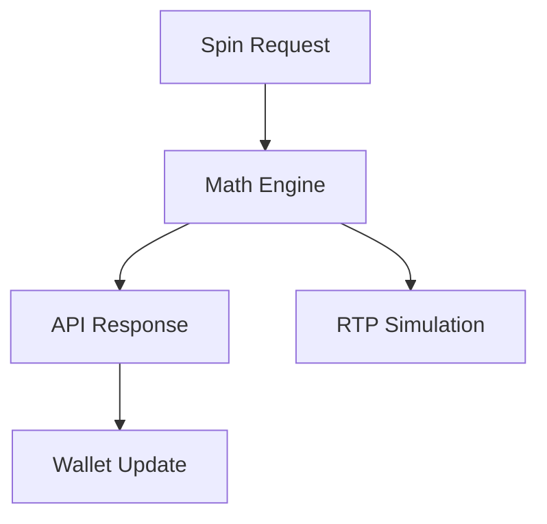

This structure was simple, but too many responsibilities were mixed together:

- raw engine output
- wallet semantics
- API serialization
- simulation metrics

That made correctness fragile.

---

## 2. First Major Discovery

The first serious issue was that the ways evaluator was mathematically incorrect for capped per-way multipliers.

### Prototype Logic

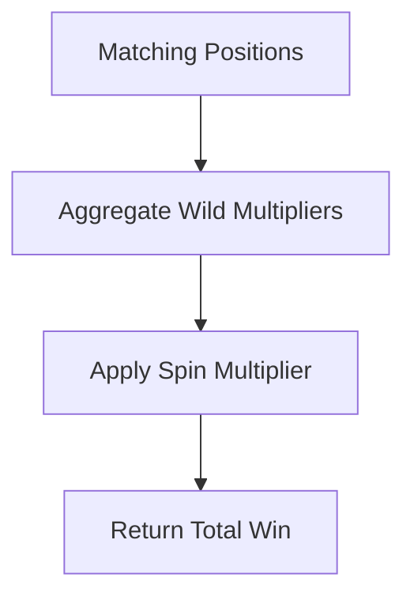

This was fast, but it silently broke when the rules required:

- per-way wild multiplier capping
- then free-spin multiplier
- then summation

### Fixed Logic

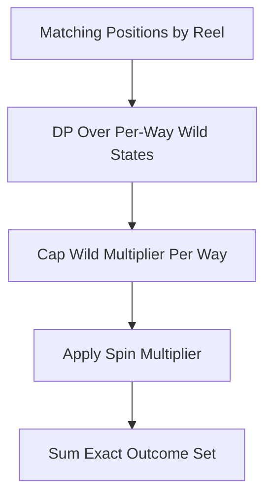

This preserved correctness while keeping the evaluator efficient.

---

## 3. Expanding Wild Constraints Across Cascades

Originally, `max_wilds_per_spin` only applied to the initial grid:

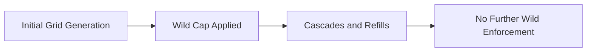

That meant a refill could produce more wilds than the spin was supposed to allow.

### Corrected Flow

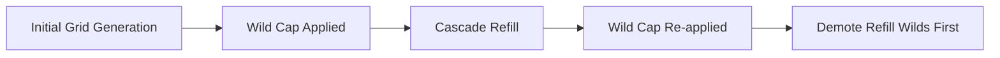

This kept the spin compliant without destabilizing surviving wild helpers.

---

## 4. Engine vs Settlement Separation

One of the most important structural changes was splitting raw math from real-money settlement.

### Before

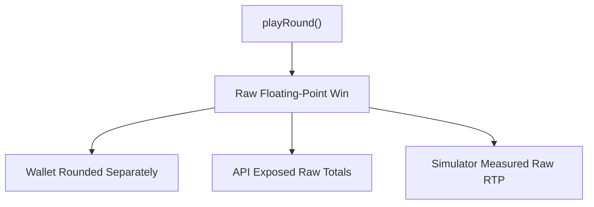

Problem:

- wallet RTP
- API RTP
- simulator RTP

could diverge.

### After

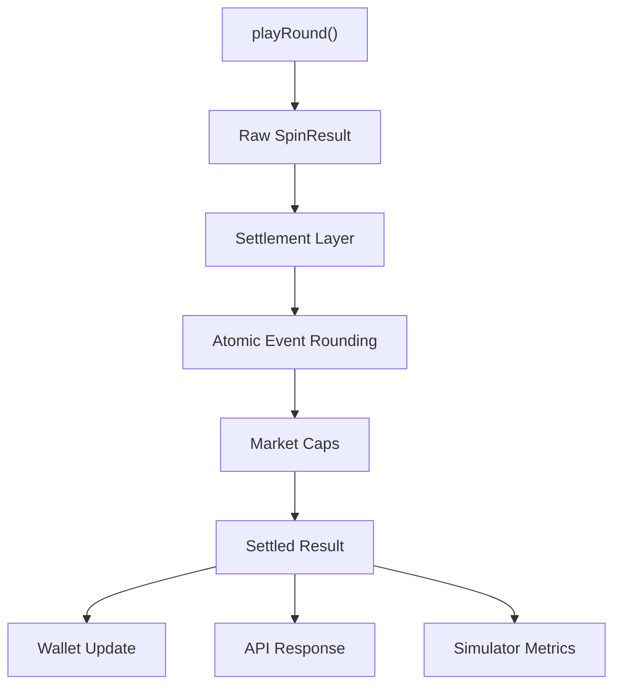

This is the point where the system stopped behaving like a demo and started behaving like a money engine.

---

## 5. Market-Specific Absolute Win Caps

Another key step was introducing market-specific caps:

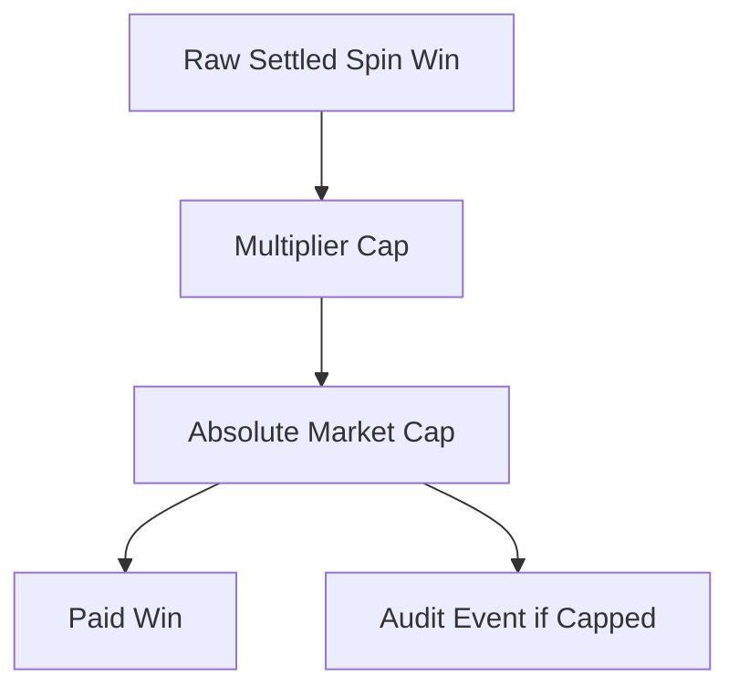

Instead of only enforcing:

- `10000x * bet`

the engine now enforces:

- `min(10000x * bet, absolute_cap_by_market)`

That is a production necessity, not a cosmetic feature.

---

## 6. Reel Model Evolution

### Prototype Reel Model

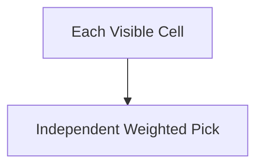

That model is easy to code, but does not behave like a real slot reel strip.

### Production-Oriented Reel Model

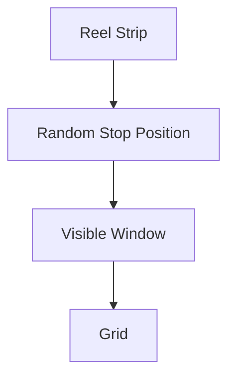

Why this matters:

- scatter visibility depends on window exposure
- adjacent symbol placement matters
- tuning reel counts is not enough without strip-aware behavior

---

## 7. Runtime Math Profiles

To tune math safely, the engine needed more than static config.

### Added Capability

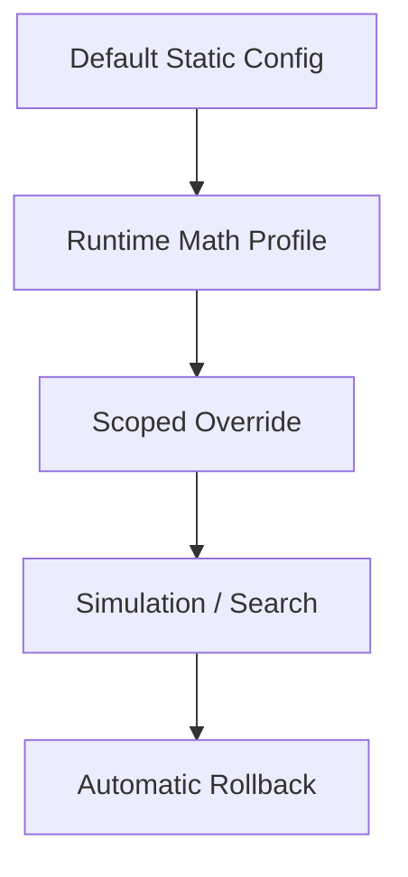

This made it possible to:

- test base/FS paytable variants
- test base/FS reel-set variants
- search over math candidates in memory
- avoid rewriting source files for each experiment

---

## 8. Free-Spin Math Freedom

The next architectural breakthrough was giving free spins their own math identity.

### Before

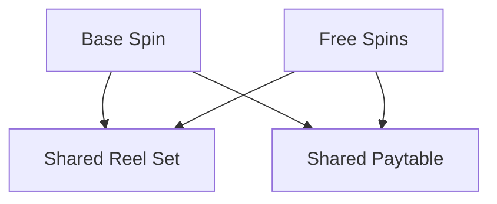

This made it hard to shape feature RTP independently.

### After

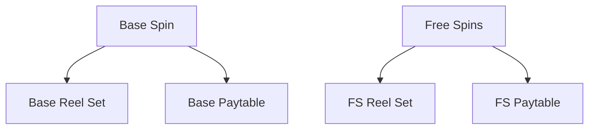

That one structural change unlocked the ability to tune:

- total RTP
- base RTP
- free-spin RTP

with much more control.

---

## 9. Search Workflow

The project then evolved from static math into a search-driven workflow:

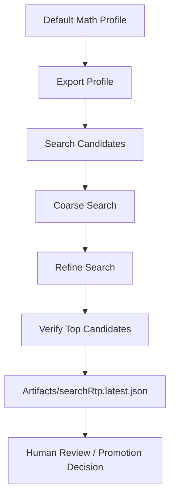

This made the system operationally useful for math iteration, not just technically correct.

---

## 10. Verification Workflow

Candidate search alone is not enough.

Profiles need their own verification path:

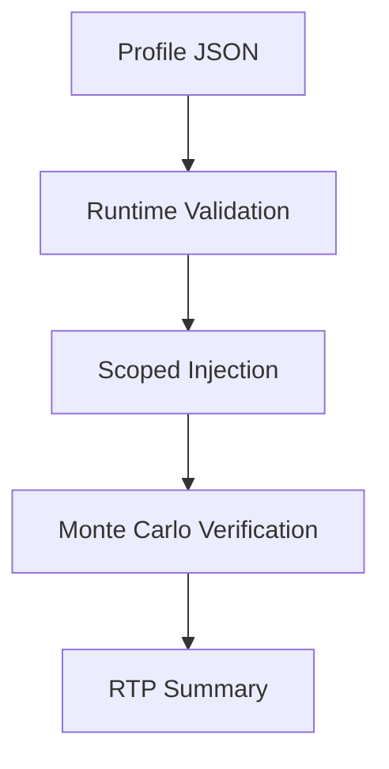

That is now provided by:

- `sim:export-profile`
- `sim:verify`
- `sim:search`

---

## 11. Test Safety Net

As flexibility increased, regressions became more dangerous.

The project added deterministic math tests covering:

- exact per-way cap behavior
- mixed capped/uncapped way sets
- free-spin paytable routing
- max wilds across cascades
- market cap behavior
- atomic rounding semantics
- runtime override reset behavior
- invalid profile rejection

### Test Role in the Architecture

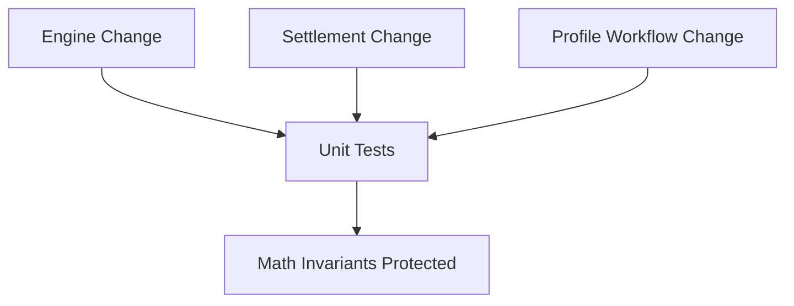

---

## 12. Final Shape of the System

By the end of the work, the architecture looked like this:

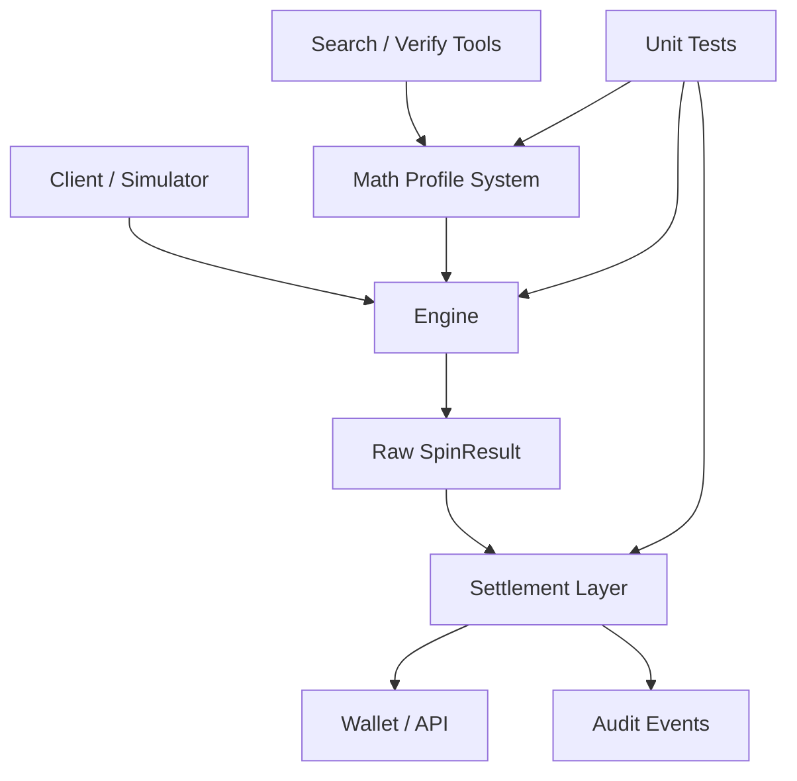

This is the architecture of a platform, not just a single game implementation.

---

## 13. What This Case Study Shows

The most important lesson is not “AI can write code”.

The stronger lesson is:

- AI can be used to iteratively audit a system
- isolate correctness problems
- redesign boundaries
- add tooling around the core
- and turn a prototype into a maintainable platform

This project is a concrete example of AI-assisted game programming at the systems level, not just at the snippet level.
